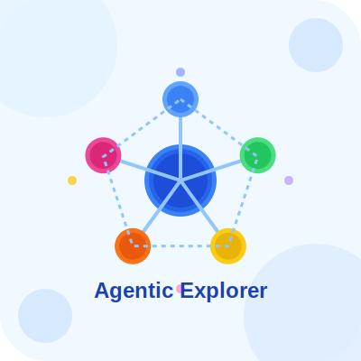

#           🚀 Agentic Explorer

<div align="center">
  
</div>

### **Diving into the Architectural Underpinnings of Agentic Systems**

## 💡 Core Concept - Why is everyone talking about Agentic AI

Retrieval-Augmented Generation (RAG) systems enhance large language models (LLMs) by feeding them relevant external information. However, traditional RAG systems often fall short—not due to LLM limitations but because of how they retrieve and integrate information. Many of these systems struggle to understand the structure and context of documents, which can lead to confusing or inaccurate responses.

Agentic Explorer is a platform designed to showcase the differences between traditional and agentic RAG approaches. It provides a transparent look at how each method handles document structure, context, and retrieval strategies. The goal is to highlight why a deeper understanding of document architecture can make or break RAG performance.

> *"Your data strategy is as important as your solution architecture."*

This concept isn't just theoretical—it has real-world implications for building reliable, production-ready AI systems.


## 🔥 Significance and Problem Statement

Agentic Explorer is designed to highlight these critical challenges, which can be categorized as the "Four Horsemen of the RAG Apocalypse":

- **Boundary Disregard**: Traditional chunking methods often break documents into pieces without respecting natural boundaries (e.g., sections, paragraphs). This random segmentation can lead to lost context and garbled responses.

- **Entity Contextual Amnesia**:  When traditional RAGs move between document chunks, they often lose track of important entities and their evolving context. This can result in inconsistent and inaccurate references throughout generated responses.

- **Conceptual Fragmentation**:  Semantically related ideas that get separated across arbitrary chunks can become isolated. Traditional RAGs often struggle to reconnect these fragments into a coherent understanding.

- **Temporal Contextual Disorientation**:  Ignoring temporal cues in documents can lead to confusion about the sequence of events or the timing of information. This is especially problematic for queries that depend on chronological accuracy.

By making these architectural differences visible and measurable, Agentic Explorer aims to elevate the conversation around RAG systems and provide a blueprint for building smarter, more resilient AI solutions.

## 🧠 Meet The Processors

Agentic Explorer is built around modular processors that can be composed in both traditional and agentic configurations:

| Processor | Purpose | What It Reveals |
|-----------|---------|----------------|
| **DocumentProcessor** | Analyzes document structure and content | Complexity factors that affect RAG performance |
| **ChunkingProcessor** | Slices documents into retrievable pieces | How intelligent boundaries preserve context |
| **EmbeddingProcessor** | Generates vector representations | Efficiency of different embedding approaches |  
| **IndexProcessor** | Manages vector database operations | Storage and retrieval mechanics |
| **RetrievalProcessor** | Finds relevant chunks for queries | How entity-aware search outperforms basic similarity |
| **SummarizationProcessor** | Creates different summary types | How summary strategy affects understanding |
| **SynthesisProcessor** | Combines retrieved info into answers | Why multi-agent synthesis reduces hallucinations |

## 🤖 The Agentic Approach

At its core, "agentic AI" means breaking down complex tasks into specialized roles rather than expecting a single model to do everything. Instead of one overwhelmed LLM, we create a team of specialized agents that each handle a specific aspect of the problem:

| Agent | Based On | Responsibility |
|-------|----------|----------------|
| **Boundary Detective** | ChunkingProcessor | Identifies natural document transitions |
| **Entity Tracker** | RetrievalProcessor | Disambiguates and tracks entities across chunks |
| **Context Connector** | RetrievalProcessor | Finds relationships between information fragments |
| **Research Analyst** | SynthesisProcessor | Extracts and evaluates relevant facts |
| **Information Synthesizer** | SynthesisProcessor | Creates coherent responses from fragmented information |
| **Quality Controller** | SynthesisProcessor | Evaluates factual accuracy and completeness |

Each agent is a lightweight wrapper around our processors, adding specialized prompting and decision-making. This approach represents both a practical architecture and an educational metaphor - breaking down complex systems into understandable components mirrors how human teams tackle difficult problems.

## 🔬 Technical Approach

### File Structure

```
agentic-explorer/
├── processors/
│   ├── __init__.py 
│   ├── chunking.py         # Chunking strategies (fixed-size vs. boundary-aware)
│   ├── document.py         # Document analysis and metrics
│   ├── embedding.py        # Vector embedding generation 
│   ├── index.py            # Vector storage (ChromaDB or in-memory)
│   ├── retrieval.py        # Search methods (vector, entity-aware, hybrid)
│   ├── summarize.py        # Multi-strategy summarization
│   └── synthesis.py        # Response generation approaches
├── utils/
│   ├── __init__.py
│   └── openai_client.py    # OpenAI API wrapper
├── analysis.py             # Core analysis pipeline
├── orchestration.py        # Workflow coordination
├── run_demo.py             # CLI interface
├── config.py               # Configuration management
├── requirements.txt        # Dependencies
└── README.md               # You are here
```

## 🚀 Getting Started

### Installation

```bash
# Clone the repo
git clone https://github.com/your-username/agentic-explorer.git
cd agentic-explorer

# Create a virtual environment
python -m venv venv
source venv/bin/activate  # On Windows: venv\Scripts\activate

# Install dependencies
pip install -r requirements.txt

# Set up environment variables
echo "OPENAI_API_KEY=your-api-key-here" > .env
```

### Running the Demo

```bash
# Basic RAG showdown
python run_demo.py --document data/samples/mixed_earnings.txt

# With document understanding phase
python run_demo.py --document data/samples/mixed_earnings.txt --summaries

# Custom query
python run_demo.py --document your_file.txt --query "Compare the financial performance of Apple and Microsoft"
```

## 🧪 Development Notes

### Adding New Strategies

Agentic Explorer is designed for extensibility. To add a new chunking, retrieval, or synthesis strategy:

1. Add the strategy implementation to the appropriate processor
2. Update the `compare_*` methods to include your strategy
3. Implement any necessary evaluation metrics

### Metrics Schema

The project uses a standardized metrics schema for visualization and comparison:

```python
{
  "comparison_type": "string",
  "compared_entities": [
    {
      "name": "string",
      "description": "string",
      "metrics": {
        "metric_name": {
          "value": number,
          "display_format": "string",
          "visualization_hint": "string",
          "interpretation": "string"
        }
      }
    }
  ]
}
```

## 🔮 Future Work

- **Interactive Visualizations**: Clickable nodes showing agent interaction graphs
- **Challenge Document Set**: Curated examples that break traditional RAG in educational ways
- **Hybrid Strategy Development**: Best-of-both-worlds approaches for different document types
- **Streaming Agent Thinking**: Real-time visualization of agent reasoning

## 📜 License

This project is licensed under the MIT License - see the LICENSE file for details.

---

*Built while surviving on coffee by Kris Naleszkiewicz | [LinkedIn](https://www.linkedin.com/in/kris-nale314/) | [Medium](https://medium.com/@kris_nale314)*

<div align="center">
  <i>"The problem isn't that AI hallucinates - it's that we're hallucinating about how AI works."</i>
</div>